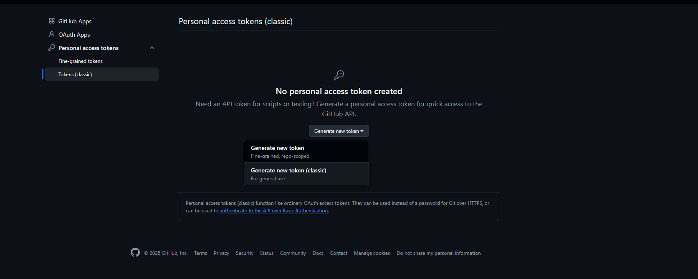
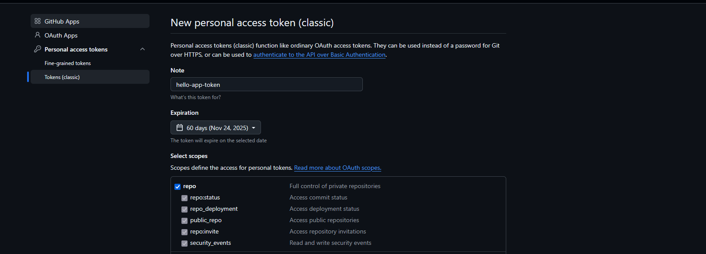
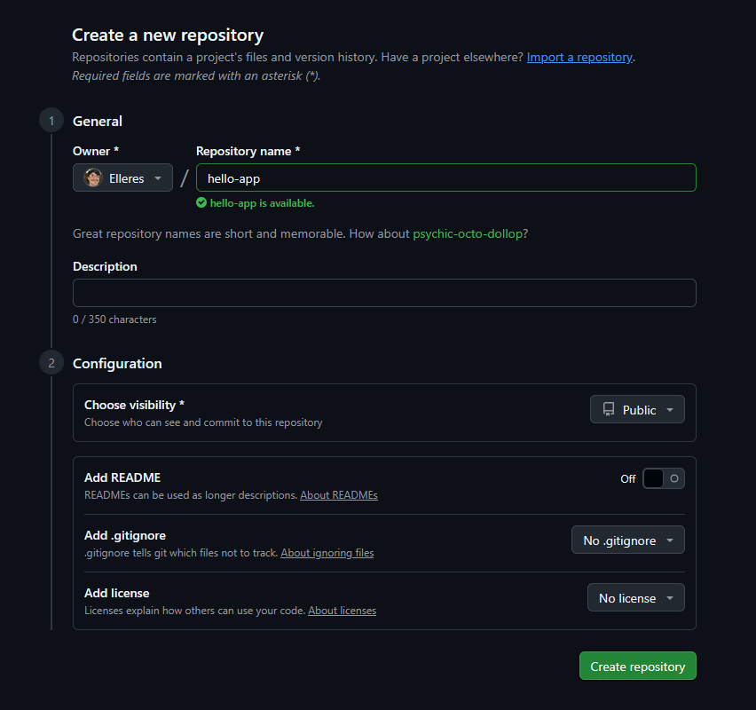
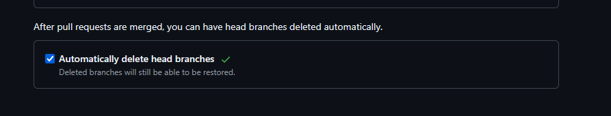

# Projeto 4 - CI & CD

Nesse projeto iremos implementar uma pipeline para buildar a imagem, colocar no docker hub, baixar a imagem e rodar na máquina local.


## Etapa 0: Pré-requisitos

Nesse projeto utilizaremos o Rancher Desktop (com Kubernetes habilitado), FastAPI (Python) e ArgoCD em um sistema operacional Windows 11. Para isso, você deve instalar todas essas ferramentas. 

### Instalando o Rancher

Para isso, entre no site: https://rancherdesktop.io/ e selecione a versão para Windows. Isso irá começar um download. Você pode seguir normalmente o Wizard de instalação, não será necessário alterar nenhuma configuração padrão.

Após instalar, você deverá abrir o Rancher Desktop e entrar em preferências. Entre na aba "Container Engine" e selecione "containerd". Além disso, você precisa entrar na aba "Kubernetes" e habilitar o Kubernetes. 

### Instalando o ArgoCD

Crie um namespace com o comando ```kubectl create namespace argocd```. Após isso execute:

```kubectl apply -n argocd -f https://raw.githubusercontent.com/argoproj/argo-cd/stable/manifests/install.yaml```

Dessa forma, você terá o ArgoCD rodando no namespace correto. Se você quiser verificar se está tudo correto pode executar o comando kubectl get pods -n argocd.

Após isso, precisamos fazer o redirecionamento de porta para acessar o serviço no navegador web, para isso execute:

```kubectl port-forward svc/argocd-server -n argocd 8070:80``` 

E então acesse: https://localhost:8070.

Para descobrir a senha, rode o comando abaixo no terminal:

```kubectl -n argocd get secret argocd-initial-admin-secret -o go-template="{{.data.password | base64decode}}"```

O usuário é: admin.

## Etapa 1: Criando tokens de acesso
### Criando Personal Access Token no Github

Para isso, entre em github.com e vá para configurações no seu perfil. Após isso, desça até o final da página e entre em **Developer settings**, clique em **Personal Access Tokens** > **Tokens (classic)** > **Generate new token**



Sua configuração final deve ficar que nem a imagem abaixo. Após isso, pode clicar em criar token (Salve o token em algum lugar que você não vai apagar, você não consegue ver ele novamente no futuro!). 



### Criando Personal Access Token no Docker Hub
Para isso, crie uma conta no Docker Hub. Depois entre em Configurações e vá na aba **Personal Access Tokens**. Clique em **Generate new token** e configure conforme a imagem abaixo. Após isso, clique em generate e salve o código em algum lugar que você não vá perder.


## Etapa 2: Criando e configurando os repositórios
### Criando o repositório contendo a aplicação

Precisaremos de dois repositórios para esse projeto, um será para os manifests do Kubernetes e o outro conterá a aplicação propriamente dita.

Primeiro, vamos criar o repositório da aplicação. Para isso, vá em github e crie um repositório público normalmente. Para esse exemplo o nome do repositório será **hello-app**.



Agora vamos configurar os segredos que teremos que usar nesse repositório. Para isso, entre no repositório e vá em configurações. Entre em **Secretes and variables > Actions** e clique em New repository secret. Você precisará criar três segredos.

- DOCKER_USERNAME: O seu usuário do Docker Hub.
- DOCKER_ACCESS_TOKEN: O seu token que criamos mais cedo no Docker Hub.
- MANIFEST_REPO_PAT: O Personal Access Token que criamos no Github.

Com isso, o repositório da aplicação está pronto, faltando somente o código propriamente dito.

### Criando o repositório de manifest

Crie mais um repositório público, dessa vez com o nome de **hello-manifests**. Além disso, você precisará habilitar a opção abaixo em **Settings > General > Automatically delete head branch** e adicionar o segredo abaixo.

- MANIFEST_REPO_PAT: O Personal Access Token que criamos no Github.


Dessa forma, quando for feito um merge nesse repositório a branch será deletada automaticamente.

## Etapa 3: Configurando o repositório da aplicação
Para fazer esse passo, siga como base o repositório https://github.com/Elleres/hello-app. Nele tem todos os arquivos que você precisa para fazer a aplicação rodar.

Crie um arquivo .py com o conteúdo do arquivo /app/main.py. Ele será nossa aplicação.

### Arquivo main.py
Nesse arquivo tem uma configuração padrão para rodar uma instância do FastAPI, que é um servidor HTTP. Não entrarei em detalhes de como funciona pois está fora do escopo, mas esse boilerplate é o que está na documentação oficial.

### Arquivo requirements.txt

Nesse arquivo tem as depêndencias do main.py, que são: FastAPI e Pydantic, ambas necessárias para que a aplicação rode.

### Arquivo Dockerfile
Esse é o arquivo de definição de como a imagem da aplicação deverá ser construída. Vou explicar linha por linha.

```FROM python:3.9``` -> Escolhendo a imagem base.

```WORKDIR /code``` -> Definindo o diretório de trabalho, onde executaremos os comandos abaixo.

```COPY ./requirements.txt /code/requirements.txt``` -> Copiando o arquivo de dependências.
```RUN pip install --no-cache-dir --upgrade -r /code/requirements.txt``` -> Instalar as dependências.
```COPY ./app /code/app``` -> Copiando a pasta contendo a aplicação.
```CMD ["fastapi", "run", "app/main.py", "--port", "80"]``` -> Executando a aplicação.

### Arquivo build.yaml

Esse é o workflow que será responsável por atualizar a imagem no Docker Hub sempre que houverem mudanças no repositório.

```name: Docker Build and Push``` -> Define o nome do workflow.

```push: branches: [ "main" ]``` -> O workflow é disparado automaticamente sempre que há um push no branch main.

```workflow_dispatch:``` -> Permite que o workflow seja executado manualmente pelo usuário na interface do GitHub.

```runs-on: ubuntu-latest``` -> Especifica que esta tarefa deve ser executada em um agente (runner) que utiliza a imagem Ubuntu Linux mais recente.

build_and_push steps: -> Inicia a sequência de passos para a tarefa, aqui vou deixar somente o nome de cada tarefa para não deixar a documentação tão extensa, vou explicar o que acontece em cada passo.

- ```name: Checkout Repository```  -> Clona o código-fonte atual (deste repositório) para dentro do agente de execução.

- ```name: Set up Docker Buildx``` -> Configura o Docker Buildx, uma ferramenta que permite construir imagens Docker de forma eficiente.

- ```name: Log in to Docker Hub``` -> Realiza o login no Docker Hub usando credenciais (usuário e token de acesso) armazenadas de forma segura nas secrets do GitHub.

- ```name: Build and push Docker image``` -> Constrói a imagem a partir do diretório atual (context: .), a envia (push: true) e aplica duas tags: a tag latest (mais recente) e uma tag única baseada no número da execução do workflow (github.run_number).

update_manifests steps: -> Atualiza o repositório com manifests. Depende do primeiro job para que seja executado, isso garante que só iniciará a execução desse job quando o primeiro acabar.

- ```name: Checkout Manifests Repository``` -> Baixa um repositório Git diferente (o repositório de manifestos, que contém arquivos de deploy como YAML do Kubernetes).

- ```name: Update image tag in manifest``` -> Executa um comando sed para editar o arquivo manifests/hello-app.yaml, substituindo a tag da imagem Docker antiga pela nova tag gerada no build (github.run_number).

- ```name: Create Pull Request```  -> Cria um Pull Request (PR) no repositório de manifestos com a alteração da tag da imagem.

## Etapa 4: Configurando o repositório dos manifests

Para o repositório dos manifests, precisamos configurar dois arquivos diferentes. 

### Arquivo auto-merge.yaml
Esse é o workflow que vai fazer o merge quando uma PR tiver o nome que comece com **update-hello-app-image-** conforme o workflow do repositório da aplicação.

```pull_request_target:``` -> Se a branch for alvo de pull request, executar o workflow.

```permissions:``` -> Define as permissões para o job.

auto-merge steps: -> Clona e faz merge no repositório.

```name: Checkout Repository``` -> Fazer o clone do repositório.

```name: Enable Auto-Merge``` -> Fazer merge da pull request alvo.

### Arquivo deploy.yaml

```kind: Deployment```  -> Define um recurso de Deployment chamado hello-app-deployment.

```spec: replicas: 2``` -> Garante que 2 cópias (réplicas) da aplicação estejam sempre em execução.

```selector: matchLabels: app: hello-app``` -> Especifica que o Deployment irá gerenciar Pods com o label app: hello-app.

```template: metadata: labels: app: hello-app``` -> Define o template para os Pods com o label app: hello-app.

```containers: - name: hello-app-container``` -> Define um container chamado hello-app-container dentro do Pod.

```image: gelleres/hello-app:10``` -> Usa a imagem Docker gelleres/hello-app:10.

```ports: - containerPort: 80``` -> Indica que o container está ouvindo na porta 80.


```kind: Service``` -> Define um recurso de Service chamado hello-app-service.

```spec: selector: app: hello-app``` -> O Service irá direcionar o tráfego para os Pods com o label app: hello-app (os Pods criados pelo Deployment).

```ports: - protocol: TCP``` -> Usa o protocolo TCP.

```port: 8080``` -> O Service é acessível externamente na porta 8080.

```targetPort: 80``` -> O tráfego recebido na porta 8080 será encaminhado para a porta 80 dos containers (onde a aplicação está rodando).

```type: LoadBalancer``` -> Define que o Service será exposto usando um balanceador de carga.

## Etapa 5: Configurando o ArgoCD
Antes de rodar a aplicação, precisamos criar o namespace onde os pods ficarão. Para isso, execute ```kubectl create namespace hello-app```

Ao entrar no ArgoCD, clique em Create Application e clique para editar como yaml. Copie o conteúdo do arquivo **argocd-config.yaml** e cole na parte correta. Após isso, clique em Create.


Assim, sua aplicação estará rodando no kubernetes. Você deve acessá-la pelo load balancer. Para isso, entre em **http://localhost:8080**.
